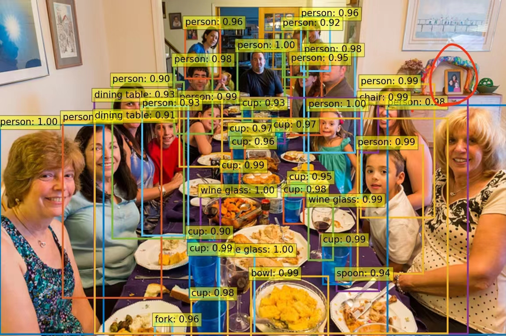
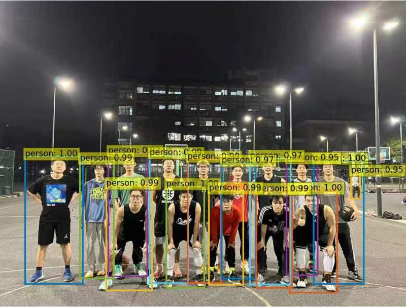

# Brief Summary of the SRTP research

### 1. Introduction

This research is completed by me(Yuxuan Liu) and another group member. It focues on the application of transformers in object detection.

### 2. Research Process

This research is done in the following steps

1. Read papers in the relevant field, including the famous paper, [Attention Is All You Need](https://doi.org/10.48550/arXiv.1706.03762).
2. Understand the mathematical principles behind the model’s operation.
3. Train the Detection Transformer (DETR) model provided in the paper and apply the trained model to test images.
4. Further understand possible directions for improving the model.

### 3. Research results 

The trained DETR model performs well in the test images, Here are two of them:

Fig 1. Detection result of an image in the test set

Fig 2. Detection result of an image shot in the ZJU basketball field

It can be observed that both people and things on the desk are correctly detected in Fig 1. It can be also observed that the picture in the red circle in fig 1, due to its smaller size, is not detected.

In Fig 2, it can be observed that all basketball players, including the person behind the team in the front, is successfully detected.

It comes out that the model performs well in complicated scenarios, but it lacks the ability to detect small objects, which is mentioned in the original paper.

Further improvements are also researched, like the [SOF-DETR]( https://dx.doi.org/10.36227/techrxiv.16921000.v2) model.
